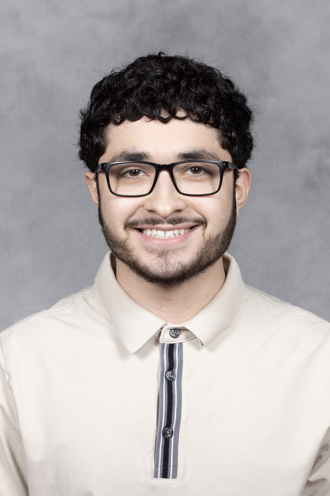

# Welcome​

*This unofficial profile was created as a demo of a job market website in Jekyll, hosted on GitHub Pages.*

My name is Alex Reynosoa and I am a Junior studying computer science at Northern Illinois University

### Background

My name is Alex Reynoso, and I’m a junior studying Computer Science at Northern Illinois University. I’m passionate about technology and driven by the goal of becoming a software engineer. I’m constantly seeking opportunities—whether through research or hands-on projects—that allow me to grow, deepen my technical skills, and expand my understanding. At my core, I’m a lifelong learner who’s always striving to improve and take on new challenges.

